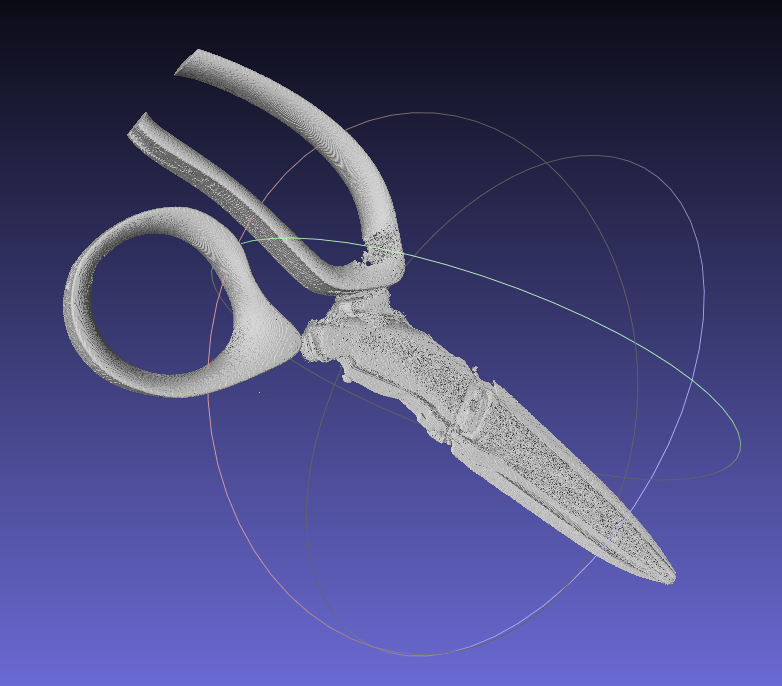
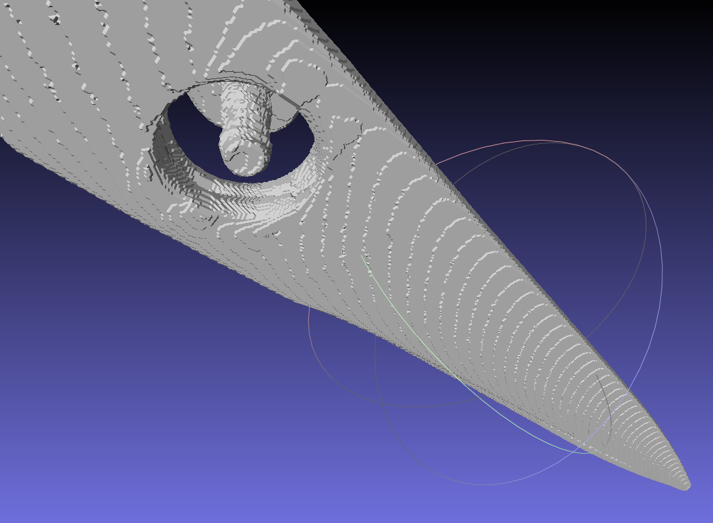
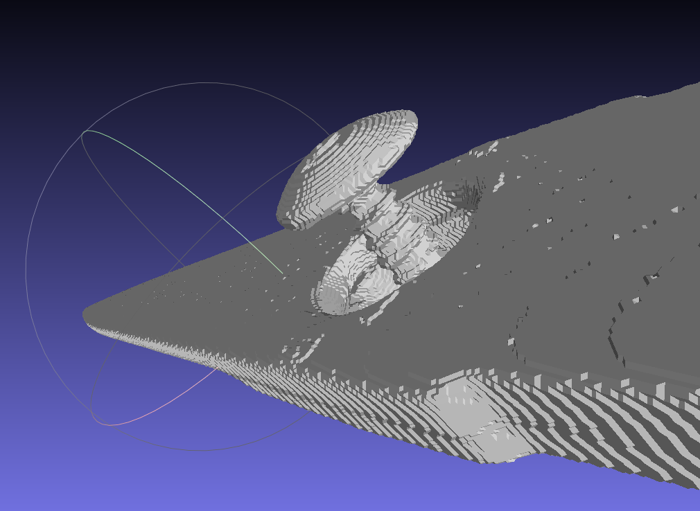
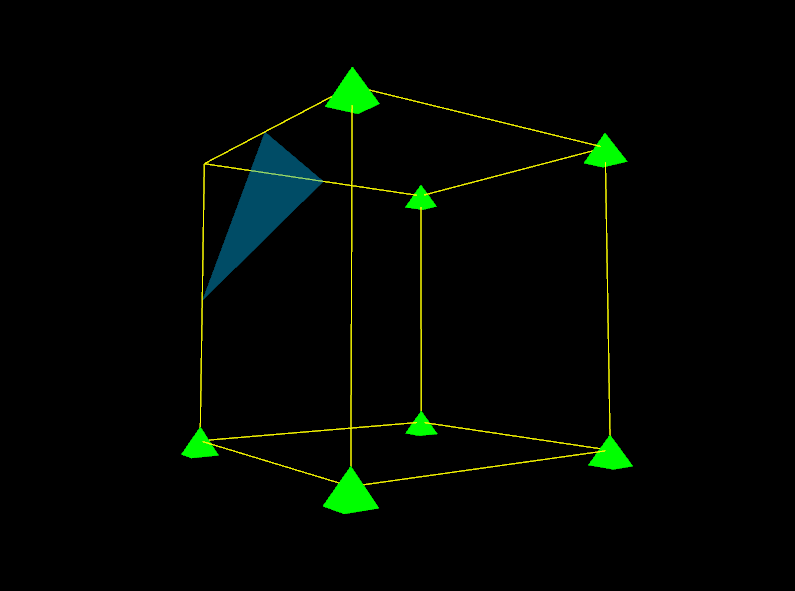
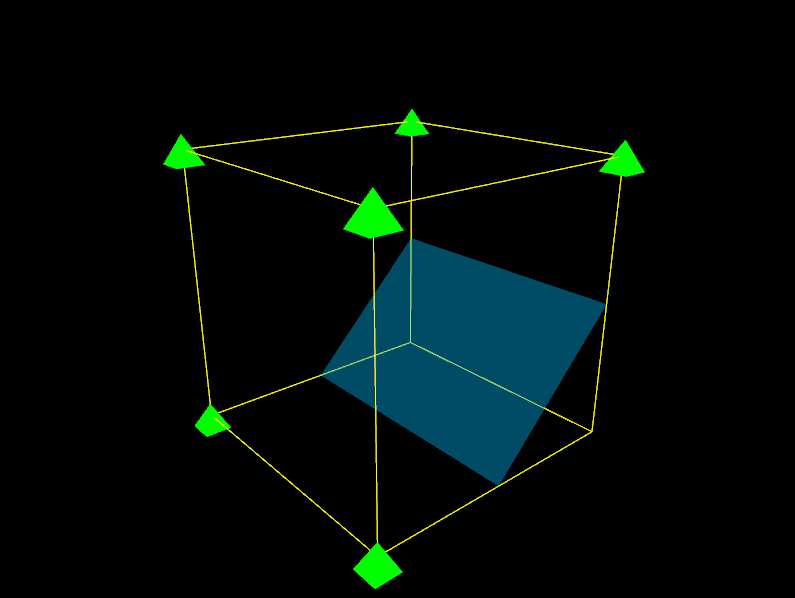
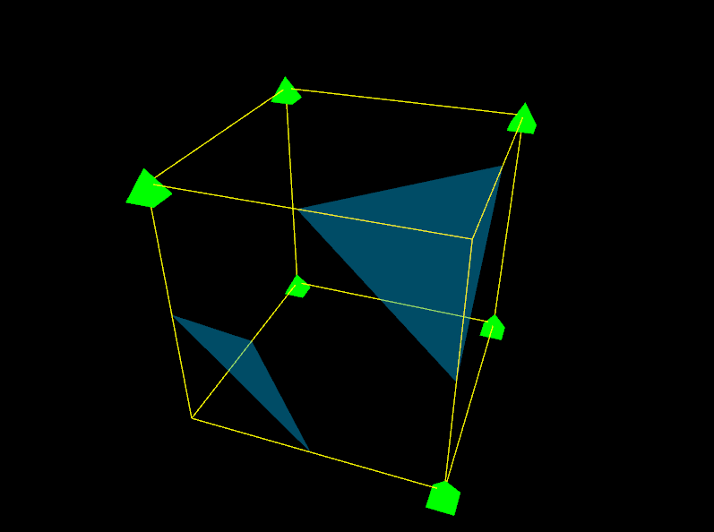
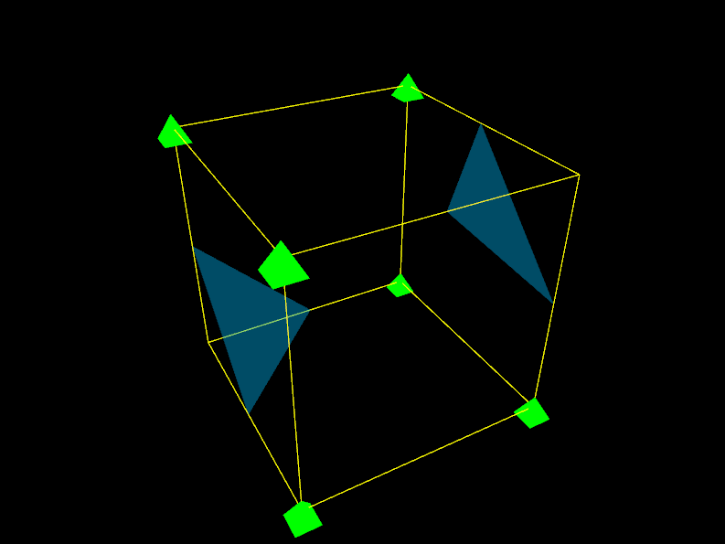
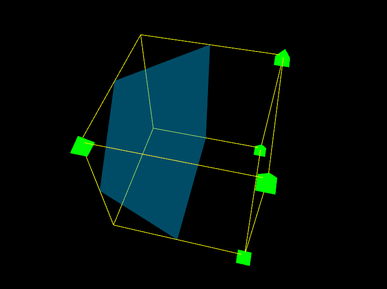
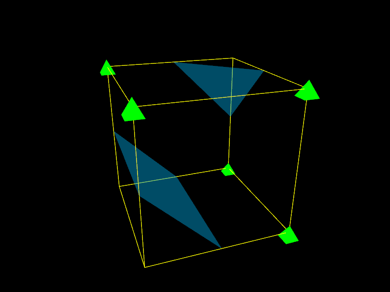
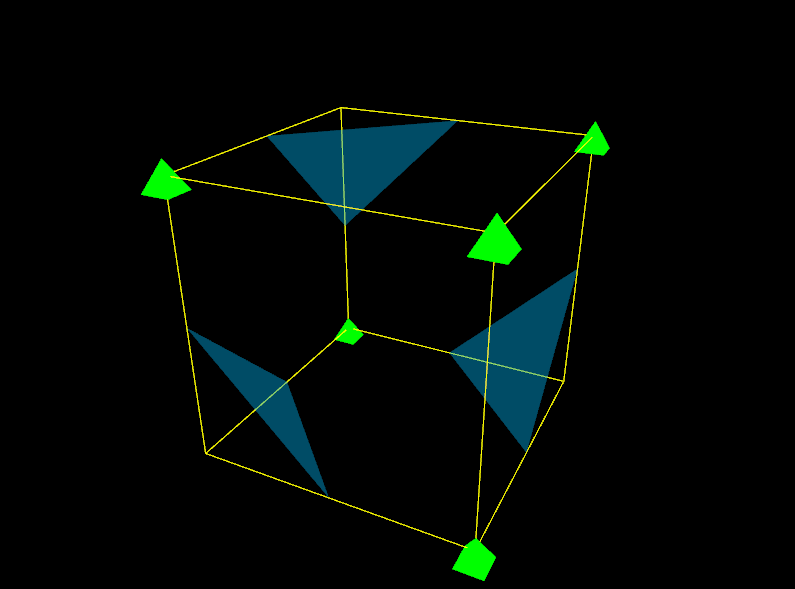

# Meshing
Point cloud meshing implementation for CT tool.

Starting with basic marching cubes and visualization for debugging and future development.

## Example

This example is using two material scissors with plastic handles.

### Blades

### Handles

### Screw close view 1

### Screw close view 2

# Marching Cubes cases: 

## Case 1

## Inversed Case 1

## Case 2

## Inversed Case 2

## Case 3

## Inversed Case 3

## Case 4

## Inverted Case 4

## Case 5

## Inverted Case 5

## Case 6

## Inverted Case 6

## Case 7

## Inverted Case 7

## Case 8

## Case 9

## Case 10

## Case 11

## Case 12

## Case 13

## Case 14

