# Meshing
Point cloud meshing implementation for CT tool.

Starting with basic marching cubes and visualization for debugging and future development.

## Case 1
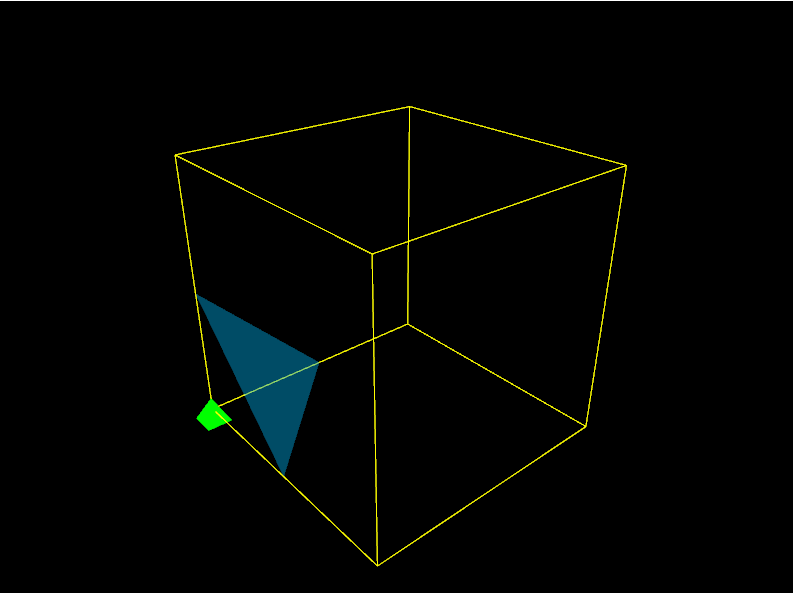

## Case 2
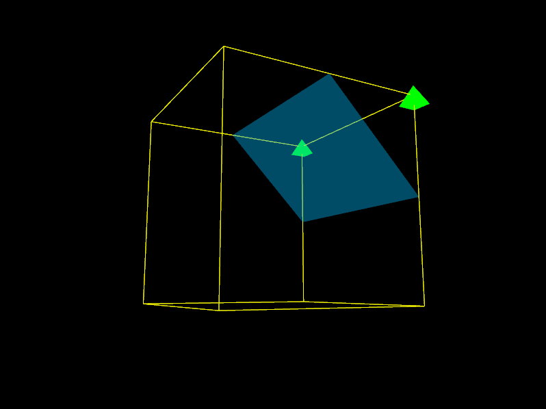

## Case 3
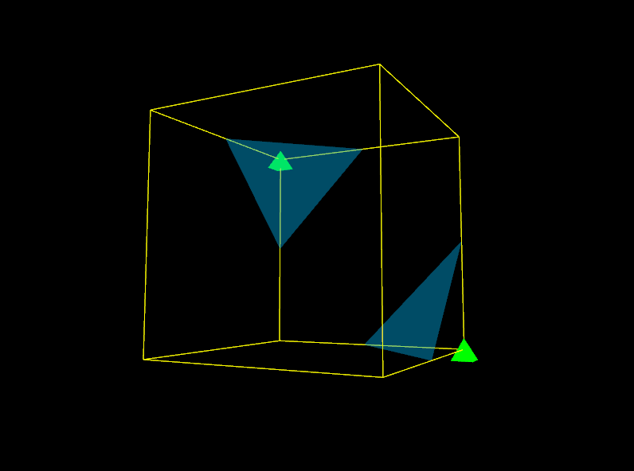

## Case 4
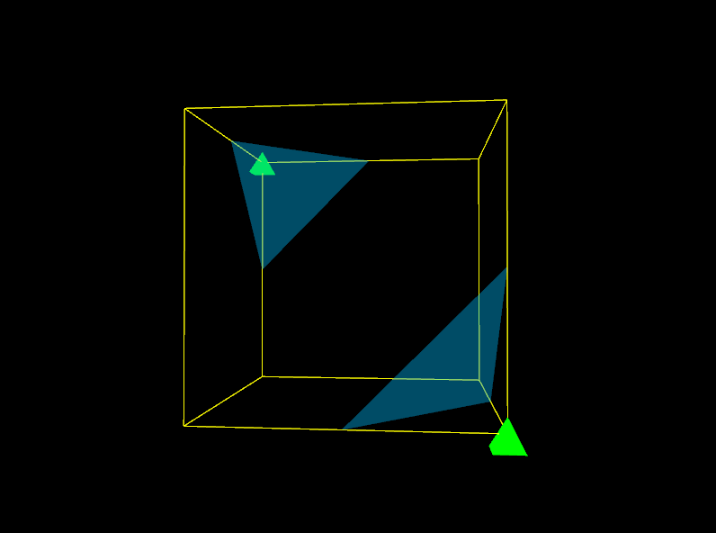

## Case 5
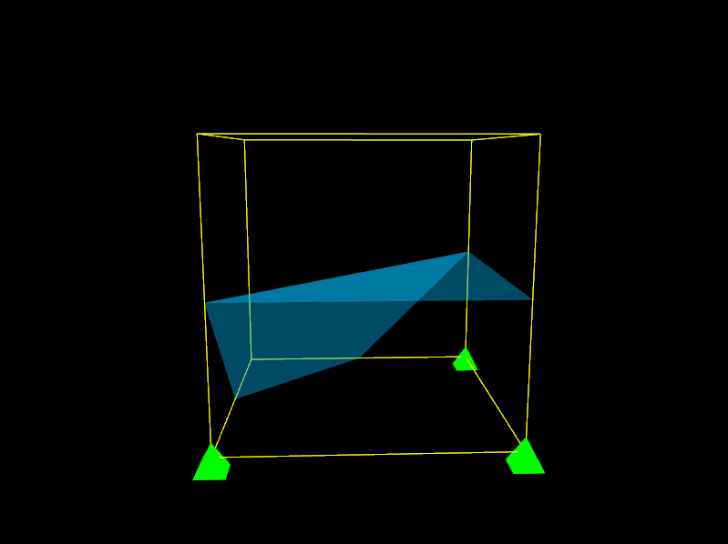

## Inverted Case 5

## Case 6
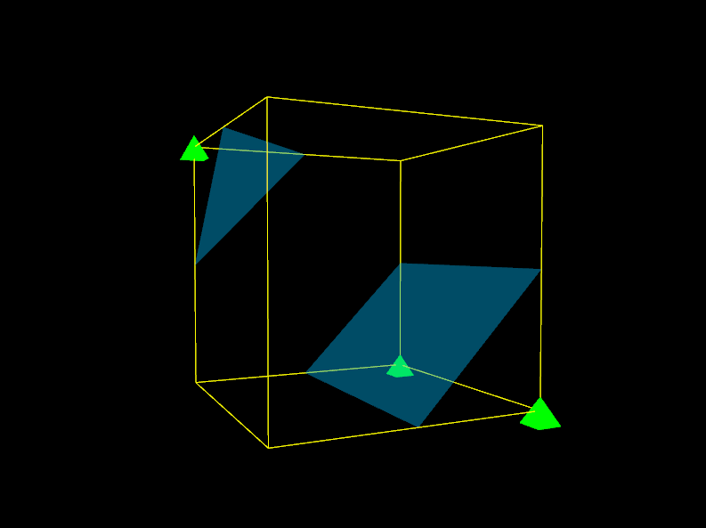

## Case 7

## Case 8
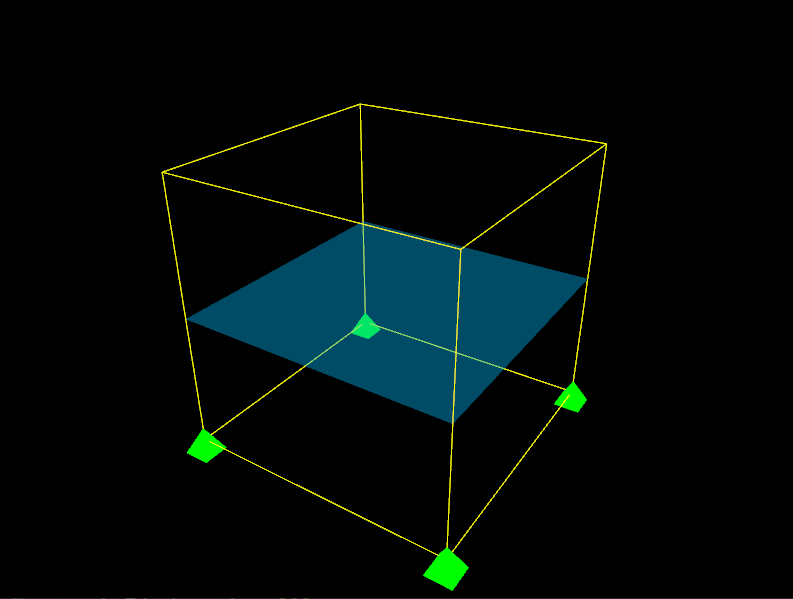

## Case 9
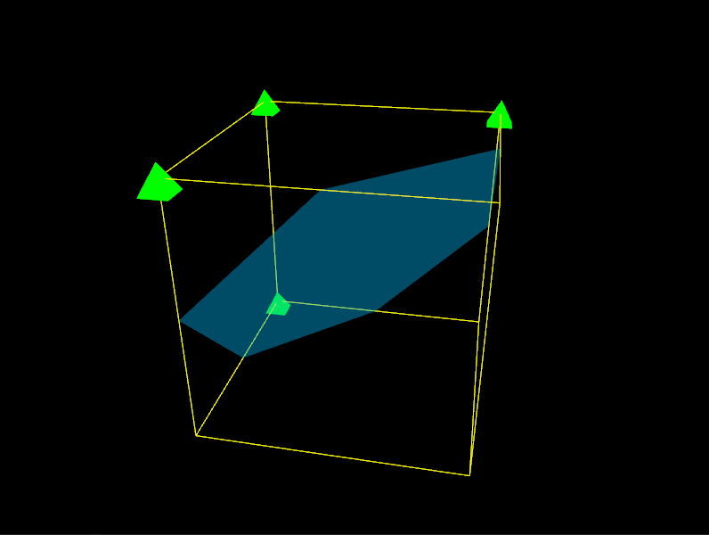

## Case 10
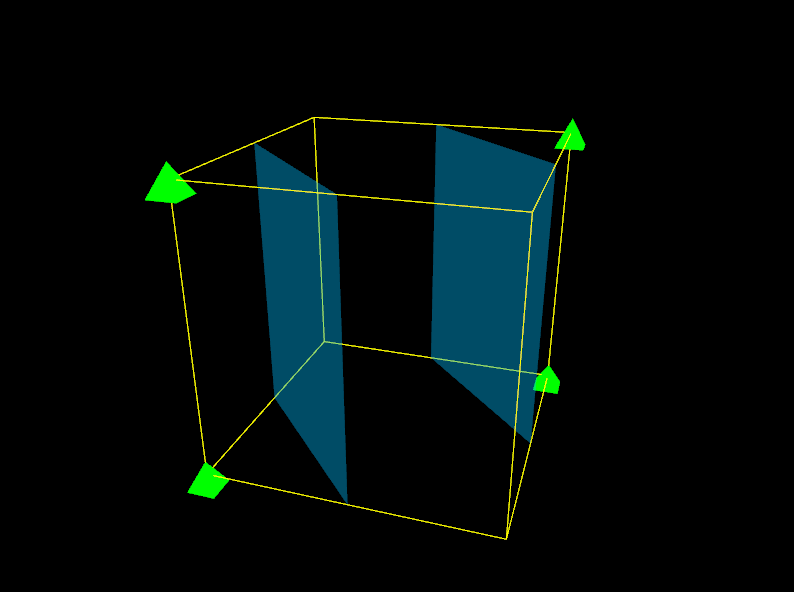

## Case 11
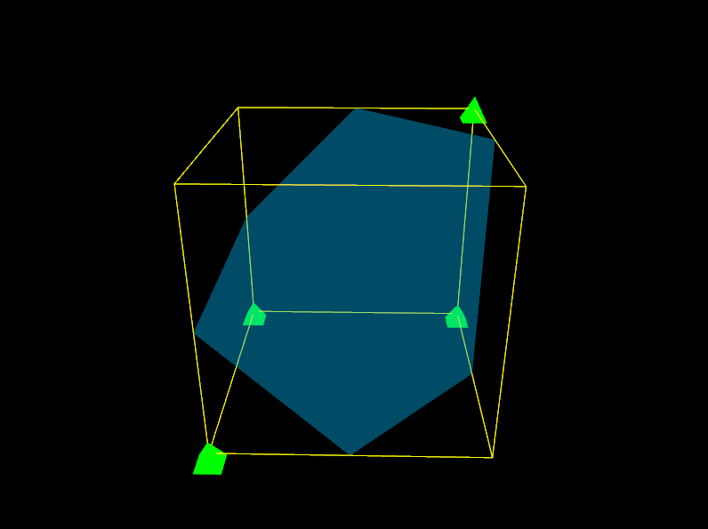

## Case 12
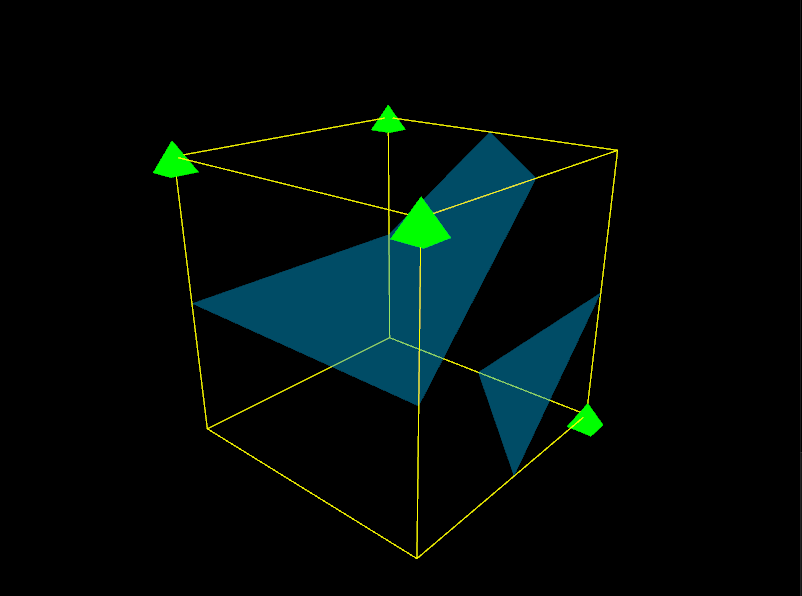

## Case 13
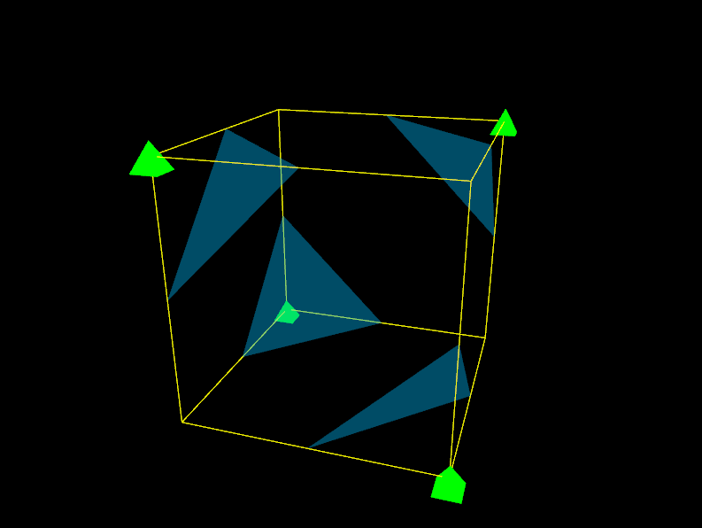

## Case 14
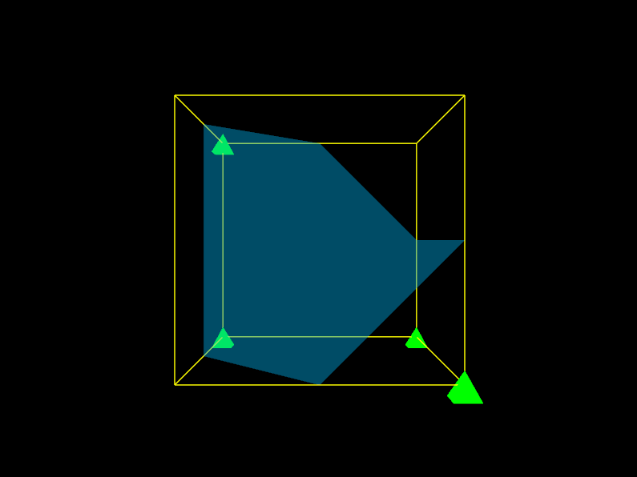
